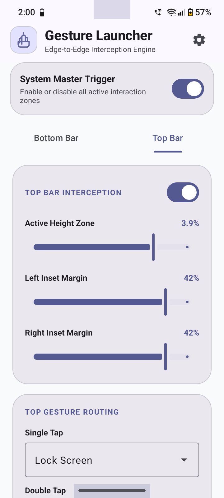
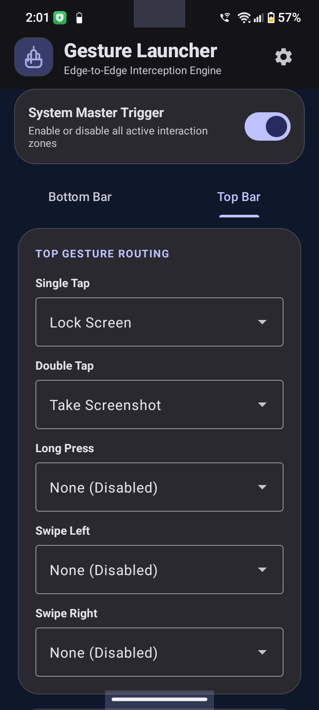
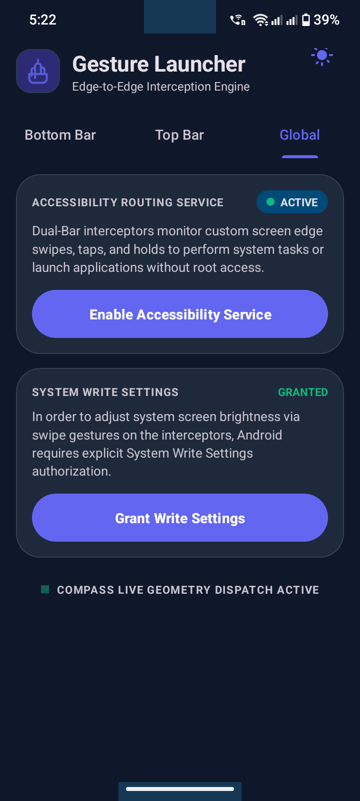
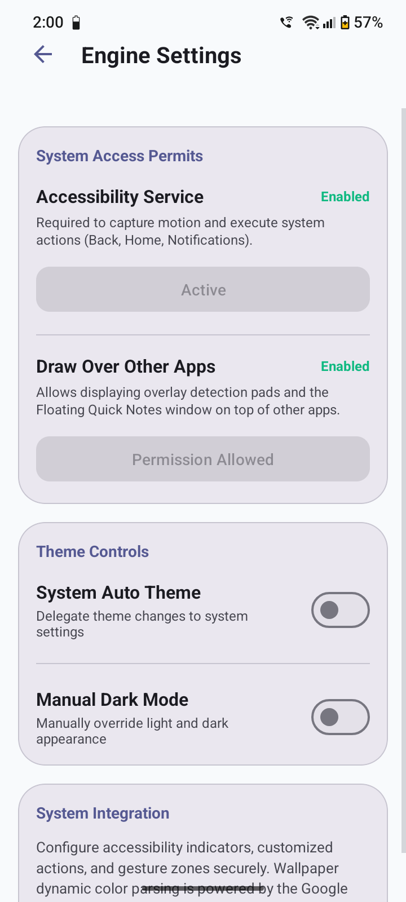
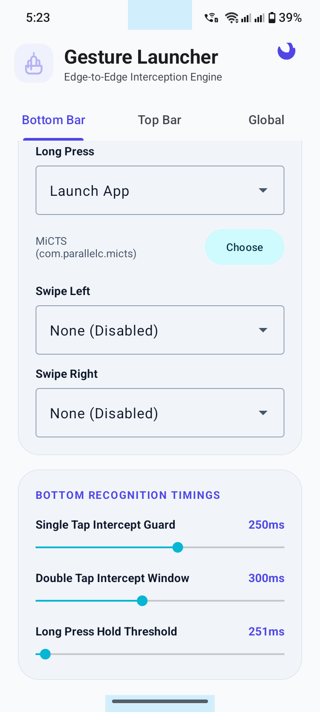
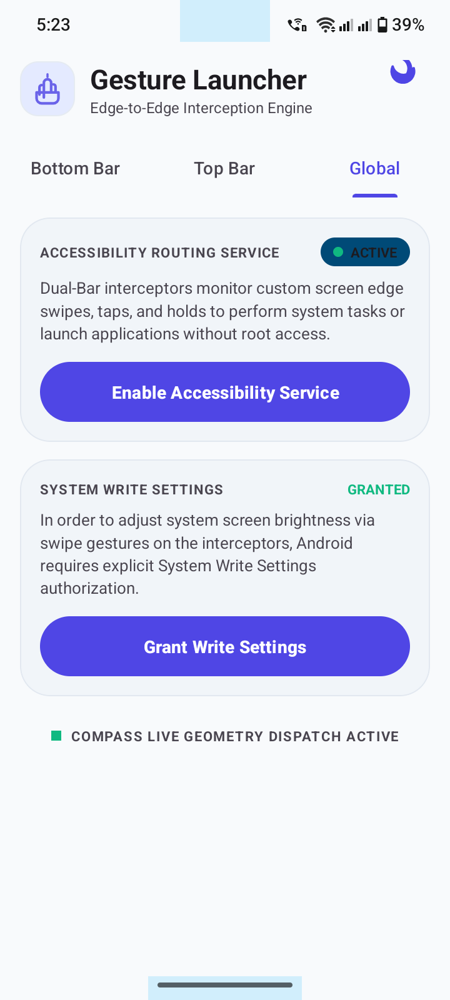

# Gesture Launcher 🚀
**Gesture Launcher** is a production-ready Android utility application built in Java that leverages the **Android Accessibility Service API** to intercept independent touch boundaries at the very top (Status Bar Area) and bottom (Navigation Bar Area) of the screen. It enables users to trigger custom global system actions or launch target applications instantly from any screen using multi-gesture inputs.
<p align="center">

</p>
## ✨ Features
 * **Dual-Bar Interception Architecture:** Independent, isolated monitoring environments for both the Top Status Bar and Bottom Navigation Bar.
 * **Granular Touch Boundary Tuning:** Multi-directional adjustments (Top height, Left margin, Right margin) using floating-point density scaling (0.1% to 5%) via SeekBars.
 * **Comprehensive Gesture Matrix:** Separate configurations for 5 distinct touch event states per bar:
   * **Single Tap** (with configurable validation delays)
   * **Double Tap** (with custom detection time windows)
   * **Long Press** (with accurate custom millisecond thresholds)
   * **Swipe Left** (horizontal delta calculations)
   * **Swipe Right** (horizontal delta calculations)
 * **Isolated Timings Infrastructure:** Completely separated gesture recognition clock ticks for Top and Bottom handles stored via SharedPreferences.
 * **Robust Action Routing:** * **Launch App:** Asynchronous Installed App Picker (BottomSheet RecyclerView) to search and map native packages cleanly.
   * **System Shortcuts:** Hardware triggers like Take Screenshot, Expand Notifications, and Lock Screen.
   * **Hardware Controls:** Direct display brightness shifting and audio streams manipulation.
 * **Premium Material Design 3 UI:** Tabbed-Layout interface utilizing TabLayout and ViewPager2 supporting dynamic automated DayNight Light/Dark theme switching with clean outlined exposed dropdown menus.
 * **TalkBack-Safe Implementation:** Built cleanly without utilizing touch exploration flags to completely mitigate touch response freezing or dual-finger lock bugs.
## 📸 Screenshots
<p align="center">



</p>
<p align="center">



</p>
## 🛠️ Project File Structure
```text
GestureLauncher/
│
├── app/
│   ├── src/
│   │   ├── main/
│   │   │   ├── java/com/mahadi/gesturelauncher/
│   │   │   │   ├── MainActivity.java                # Main entry, ViewPager2 & window inset setup
│   │   │   │   ├── NavbarAccessibilityService.java  # Core touch mathematics & gesture engine
│   │   │   │   ├── fragments/
│   │   │   │   │   ├── BottomBarFragment.java       # Bottom edge configuration logic
│   │   │   │   │   ├── TopBarFragment.java          # Top edge configuration logic
│   │   │   │   │   └── GlobalSettingsFragment.java  # System permissions & core toggles
│   │   │   │   └── adapters/
│   │   │   │       └── AppPickerAdapter.java        # Package manager async list renderer
│   │   │   │
│   │   │   ├── res/
│   │   │   │   ├── drawable/
│   │   │   │   │   ├── ic_gesture_logo.xml          # Minimalist vector asset logo
│   │   │   │   │   └── ic_theme_toggle.xml          # Dynamic light/dark vector indicator
│   │   │   │   ├── layout/
│   │   │   │   │   ├── activity_main.xml            # Tabbed container with theme toggle
│   │   │   │   │   ├── fragment_bottom_bar.xml      # Material3 cards for bottom controls
│   │   │   │   │   ├── fragment_top_bar.xml         # Material3 cards for top controls
│   │   │   │   │   └── fragment_global_settings.xml # Layout for accessibility & write toggles
│   │   │   │   └── xml/
│   │   │   │       └── accessibility_service_config.xml # Safe configuration binding flags
│   │   │   │
│   │   │   └── AndroidManifest.xml                  # System permissions & service declarations
│   │   └── build.gradle

```
## 🔒 Permissions & Safety
This application handles low-level interaction metrics to automate system navigation tasks. It requires:
 1. **BIND_ACCESSIBILITY_SERVICE**: To securely register coordinates on the edge bounds and dispatch performGlobalAction intents.
 2. **WRITE_SETTINGS**: Requested on-demand only when a gesture routing is bound to display brightness shifting tasks.
## 🚀 Getting Started
 1. Clone the repository:
   ```bash
   git clone https://github.com/yourusername/GestureLauncher.git
   
   ```
 2. Open the project in **Android Studio** (Jellyfish or newer recommended).
 3. Ensure your Gradle configuration uses target and compile SDKs set to **Android 14 (API 34)** or higher.
 4. Compile, build, and deploy the debug or release APK directly to your test hardware device.
 5. Navigate to Settings > Accessibility > Installed Apps on your phone, locate **Gesture Launcher**, and switch it on.
 * **TalkBack-Safe Implementation:** Built cleanly without utilizing touch exploration flags to completely mitigate touch response freezing or dual-finger lock bugs.
## 🛠️ Project File Structure
```text
GestureLauncher/
│
├── app/
│   ├── src/
│   │   ├── main/
│   │   │   ├── java/com/mahadi/gesturelauncher/
│   │   │   │   ├── MainActivity.java                # Main entry, ViewPager2 & window inset setup
│   │   │   │   ├── NavbarAccessibilityService.java  # Core touch mathematics & gesture engine
│   │   │   │   ├── fragments/
│   │   │   │   │   ├── BottomBarFragment.java       # Bottom edge configuration logic
│   │   │   │   │   ├── TopBarFragment.java          # Top edge configuration logic
│   │   │   │   │   └── GlobalSettingsFragment.java  # System permissions & core toggles
│   │   │   │   └── adapters/
│   │   │   │       └── AppPickerAdapter.java        # Package manager async list renderer
│   │   │   │
│   │   │   ├── res/
│   │   │   │   ├── drawable/
│   │   │   │   │   ├── ic_gesture_logo.xml          # Minimalist vector asset logo
│   │   │   │   │   └── ic_theme_toggle.xml          # Dynamic light/dark vector indicator
│   │   │   │   ├── layout/
│   │   │   │   │   ├── activity_main.xml            # Tabbed container with theme toggle
│   │   │   │   │   ├── fragment_bottom_bar.xml      # Material3 cards for bottom controls
│   │   │   │   │   ├── fragment_top_bar.xml         # Material3 cards for top controls
│   │   │   │   │   └── fragment_global_settings.xml # Layout for accessibility & write toggles
│   │   │   │   └── xml/
│   │   │   │       └── accessibility_service_config.xml # Safe configuration binding flags
│   │   │   │
│   │   │   └── AndroidManifest.xml                  # System permissions & service declarations
│   │   └── build.gradle

```
## 🔒 Permissions & Safety
This application handles low-level interaction metrics to automate system navigation tasks. It requires:
 1. **BIND_ACCESSIBILITY_SERVICE**: To securely register coordinates on the edge bounds and dispatch performGlobalAction intents.
 2. **WRITE_SETTINGS**: Requested on-demand only when a gesture routing is bound to display brightness shifting tasks.
## 🚀 Getting Started
 1. Clone the repository:
   ```bash
   git clone https://github.com/mgitlabs/Gesture-Launcher.git   
   ```
 2. Open the project in **Android Studio** (Jellyfish or newer recommended).
 3. Ensure your Gradle configuration uses target and compile SDKs set to **Android 14 (API 34)** or higher.
 4. Compile, build, and deploy the debug or release APK directly to your test hardware device.
 5. Navigate to Settings > Accessibility > Installed Apps on your phone, locate **Gesture Launcher**, and switch it on.
